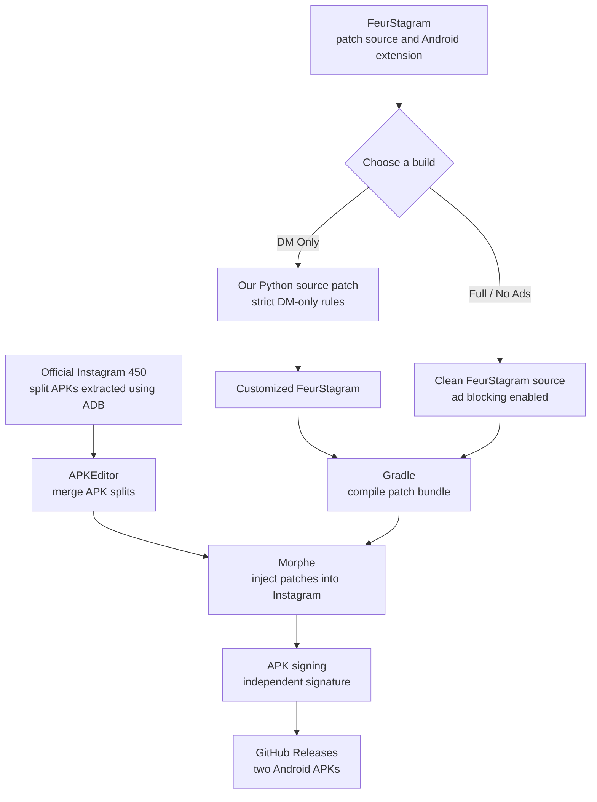

# Instagram, on our terms.

### 💬 Messages when you want focus. 🎬 The full experience when you don't.

**An experiment in taking control of Instagram — not rebuilding it.**

[**Download the builds**](https://github.com/abderrahmanbaaziz/instagram-450-builds/releases/tag/v450.0.0.50.77) · [**Read our story**](#the-story) · [**How it works**](#how-we-built-it) · [**Install**](#installation)

---

## The story

> **"I don't want to leave Instagram. I just want Instagram without the endless scrolling."**

It started with a simple idea: **what if Instagram opened straight into your messages, with no Feed, no Explore, and no Reels tab?**

But there was one catch. Friends still send Reels in DMs. We wanted to **open a Reel someone sent, watch it, reply, and leave** — *without being pulled into the next Reel, and the next one, and the next one.*

We considered two paths:

1. **Build our own DM client using Instagram's official APIs.** That wouldn't reproduce the complete native messaging experience for an ordinary personal account.
2. **Patch the real Android app.** Keep Instagram's login, messaging, media and familiar interface, while changing the routes that lead to distractions.

We chose **option two**.

We pulled **Instagram 450.0.0.50.77** from an Android phone with ADB, including its split APKs. Then we found [FeurStagram](https://github.com/jean-voila/FeurStagram): an open-source project that had already done the difficult work of locating Instagram's internal hooks for content blocking and navigation.

Rather than reinvent its patching system, **we wrote a small Python source patch that customizes FeurStagram itself**. The goal was to make the DM-only experience stricter than a collection of optional toggles.

The next chapter was practical engineering: a **Debian VPS**, **Java 21**, the **Android SDK**, **Gradle**, **APKEditor** and **Morphe** to turn a bundle of original APK splits into a modified, signed Android package.

And then came a second thought:

> **"What about normal Instagram — Feed, Stories, Reels, everything — just with fewer ads?"**

That became our **second build**. This time, we didn't need the extra DM-only source changes; FeurStagram's existing ad filters were the starting point.

**One original app. Two different experiences. One goal: more control over how we use it.**

---

## Choose your Instagram

| | 💬 **DM Only** | ✨ **Full · No Ads** |
|:--|:--|:--|
| **Purpose** | Stay connected, skip the scroll | Keep Instagram, filter ads |
| **Direct messages** | ✅ Retained | ✅ Retained |
| **Feed / Explore / Reels tabs** | 🔒 Intended to be hidden or blocked | ✅ Intended to stay available |
| **Stories and profiles** | 🔒 Restricted by DM-only rules | ✅ Intended to stay available |
| **Reels sent in DMs** | 🧪 Viewer/swap guard is experimental | ✅ Normal viewer intended |
| **Sponsored content** | Blocked by inherited filters | 🛡️ Best-effort ad filtering |
| **Custom source patch** | ✅ Our DM-only modifications | — FeurStagram base |
| **APK file** | `instagram.apk` | `instagram-no-ads.apk` |

### [📦 Download both versions — v450.0.0.50.77](https://github.com/abderrahmanbaaziz/instagram-450-builds/releases/tag/v450.0.0.50.77)

[**⬇️ DM Only · instagram.apk**](https://github.com/abderrahmanbaaziz/instagram-450-builds/releases/download/v450.0.0.50.77/instagram.apk) &nbsp; · &nbsp; [**⬇️ Full / No Ads · instagram-no-ads.apk**](https://github.com/abderrahmanbaaziz/instagram-450-builds/releases/download/v450.0.0.50.77/instagram-no-ads.apk)

**Important:** These are experimental builds. The table describes their **design goals**, not a guarantee that every behavior is verified on every device. Ad blocking may miss some sponsored content. Reel-swipe containment is **not yet confirmed** on Instagram 450.

---

## How we built it

The most important distinction in the project is this:

**Our Python patch did not directly patch Instagram. It modified FeurStagram's source code. Morphe then applied the resulting patches to Instagram's compiled Android code.**

### Who did what?

| Component | Role |
|:--|:--|
| **Instagram APK** | The original app, including its messaging and media functionality |
| **FeurStagram** | The existing patches, blocking logic, settings UI and hooks into Instagram |
| **Our `apply_dm_only.py`** | Rewrites parts of **FeurStagram's Java source** for the stricter DM-only experience |
| **Morphe** | Finds matching methods in Instagram's DEX bytecode and applies compiled patches |
| **APKEditor** | Merges the base and split APKs before patching |
| **Gradle + Java 21** | Compiles FeurStagram's patches and Android extension |
| **Android APKSigner** | Signs the resulting APK so Android can verify and install it |
| **GitHub Releases** | Hosts the APKs for direct download |

### What we changed for DM Only

Our source rewrite targeted four FeurStagram files and added one new component:

- **`Config.java`** — force the Direct inbox as the landing screen; lock content and navigation restrictions.
- **`Hiders.java`** — hide the Home tab too, while keeping Messages accessible.
- **`HomeTabWatcher.java`** — move the settings shortcut from a long-press on Home to a long-press on Messages.
- **`Settings.java`** — show the enforced restrictions as read-only and suppress selected prompts.
- **`DmOnlyReelGuard.java`** — **experimental:** look for Instagram's Reel pager and attempt to disable user swiping through `setUserInputEnabled(false)`.

That last item is **not a proven Reel-scrolling fix**. If the underlying viewer doesn't expose the expected method, it leaves the gesture untouched instead of crashing the app. Shared Reels, deep links, notifications and other routes need testing on a real phone.

### What makes the No-Ads build different?

The full build is based on a **clean FeurStagram checkout**, not our DM-only rewrite. Its ad filtering works in two places:

1. **Network layer:** reject recognized ad-related request paths before the request is completed.
2. **Feed parser:** skip recognized sponsored units embedded inside otherwise normal Feed responses.

FeurStagram also has content-blocking toggles for Reels, Feed and Explore. To use it as a *full* Instagram experience, those need to be **turned off**, while **Block Ads** stays **on**. Filtering is best-effort and may vary by app version or account.

> We built *on top of* the work of the [FeurStagram maintainers](https://github.com/jean-voila/FeurStagram). Our contribution was customizing that source for the strict DM-only goal and preparing the two Instagram 450 builds — not inventing the whole patching framework.

---

## Installation

**Android only.** Both releases are unofficial APKs, independently signed from Meta's Play Store app.

1. **Download one APK** from the [Releases page](https://github.com/abderrahmanbaaziz/instagram-450-builds/releases/tag/v450.0.0.50.77).
2. **Make sure you can log back in** and access two-factor authentication. Back up any drafts or other data stored only on your phone.
3. If you have official Instagram installed, remember that Android **cannot normally install a differently signed APK over it**. You may need to uninstall the existing app first, which clears its local data.
4. **Install the downloaded APK** on your Android phone, allowing installation from that source if prompted.
5. **Test with a secondary account first** before relying on it for everyday messaging.

If you're installing through ADB, use `adb install instagram.apk` for DM Only, or `adb install instagram-no-ads.apk` for the full build. If Android reports `INSTALL_FAILED_UPDATE_INCOMPATIBLE`, the existing app uses a different signing certificate; **don't uninstall it until you're ready to lose its local app data**.

The two builds are intended to be **alternatives**, not side-by-side installations when both use `com.instagram.android`. Switching between them may also require reinstalling if the signing certificates differ.

### Verify the release files

| File | SHA-256 |
|:--|:--|
| `instagram.apk` | `f29c7552baa8f8f0ec6c7c001b8455397efd7d1c4e0210b75a25930544d32778` |
| `instagram-no-ads.apk` | `a48e8c8843246607f669d58b02ab9facc578efbca369014ac7c4594fdfc0f3ac` |

On Windows, check with `Get-FileHash .\instagram.apk -Algorithm SHA256`. On Linux, use `sha256sum instagram.apk`. The hash helps confirm the download matches the release asset; it **does not** by itself establish that modified software is safe.

---

## What is and isn't guaranteed

- ✅ **The Android packages are published** in this repository's release.
- ✅ **The DM-only source transformations were prepared and source-level tested** against the targeted FeurStagram source anchors.
- 🧪 **The Reel swipe guard is experimental** and may not catch Instagram 450's viewer.
- 🧪 **Message features, login flows, notifications, calls, deep links and runtime blocking need on-device verification.**
- 🛡️ **Ad removal is best-effort**; server-side changes or unknown ad formats may bypass the filters.
- 🔐 **Signing is independent of Meta.** Official Play Store updates generally won't work; future custom updates should reuse the same private signing key.
- ⚠️ **Account/security risk:** Unofficial clients may violate Instagram's terms, can break without warning, and aren't endorsed or audited by Meta.

### Reporting a problem

[**Open an issue →**](https://github.com/abderrahmanbaaziz/instagram-450-builds/issues)

Please include your phone model, Android version, which build you installed, and steps to reproduce. For the experimental Reel guard, sanitized logs can help identify whether its hook was reached.

**Never include passwords, session tokens, verification codes, private messages or other personal information in an issue.**

---

## Source, attribution and distribution

This repository currently distributes **two built APKs and documentation**. It is **not yet a fully reproducible source release** of the custom DM-only patch. For independent review and reproducibility, the modified patch source and reproducible build instructions should also be published (without private keystores, tokens, or credentials).

**Special thanks and technical foundations:**

- [FeurStagram](https://github.com/jean-voila/FeurStagram) — upstream Instagram modifications and build process.
- [Morphe](https://github.com/MorpheApp) — the bytecode patching engine.
- [APKEditor](https://github.com/REAndroid/APKEditor) — APK split merging and editing tools.

Respect upstream licenses and third-party rights. **Instagram and its branding belong to Meta.** The modified APKs contain proprietary application code. This project is **not affiliated with or endorsed by Instagram or Meta**; publicly redistributing those binaries may lead to intellectual-property or platform-policy claims.

---

### Less scrolling. More intentional use.

*It began with a question about a DM-only Instagram — and became an experiment in making the app work for us.*

[⬆ Back to top](#instagram-on-our-terms)

